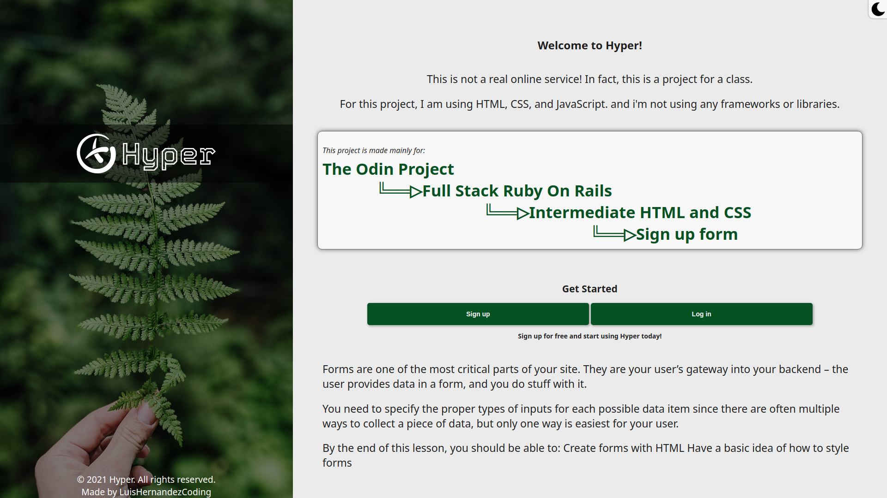
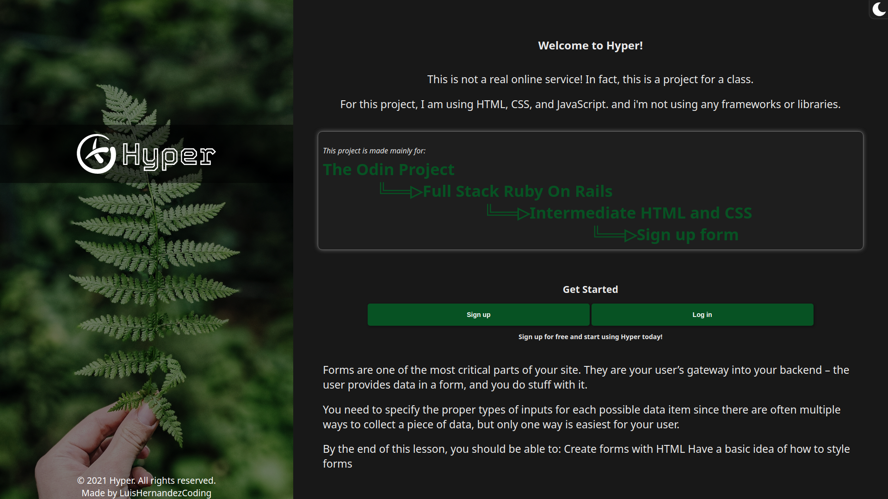
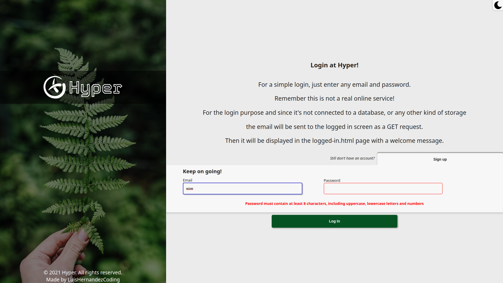
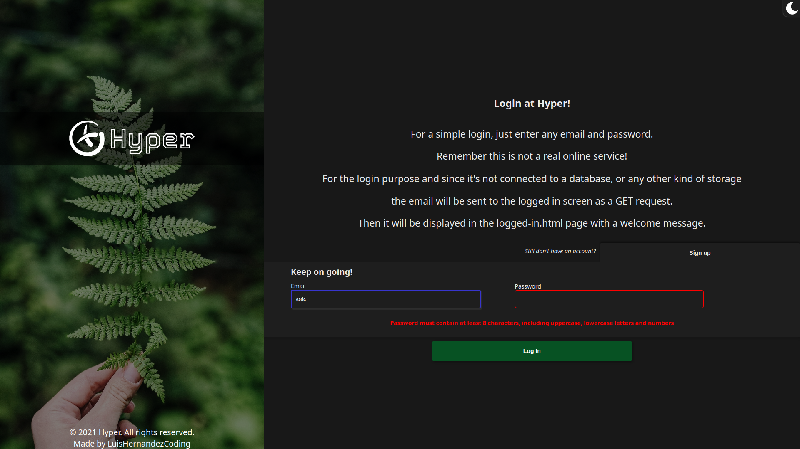
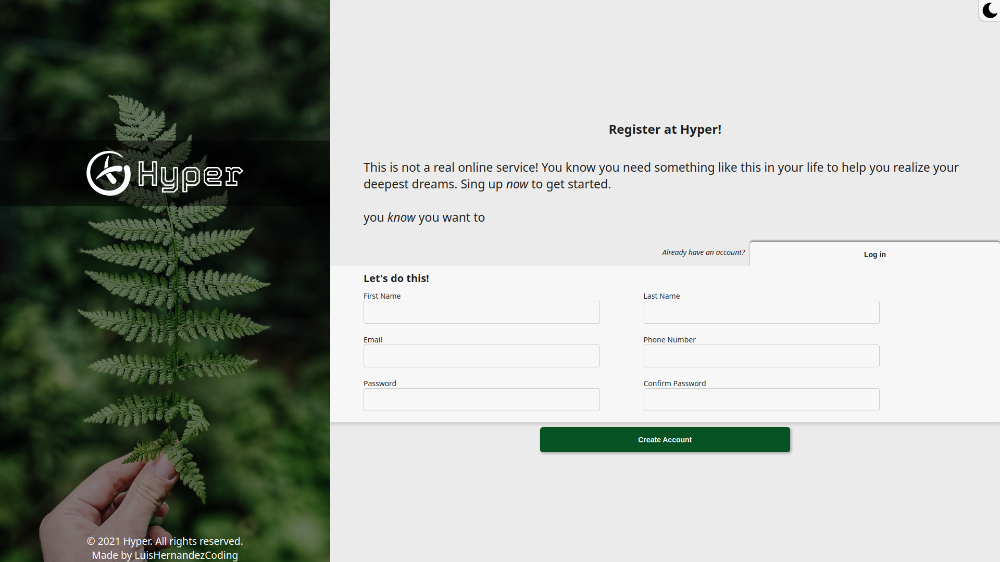
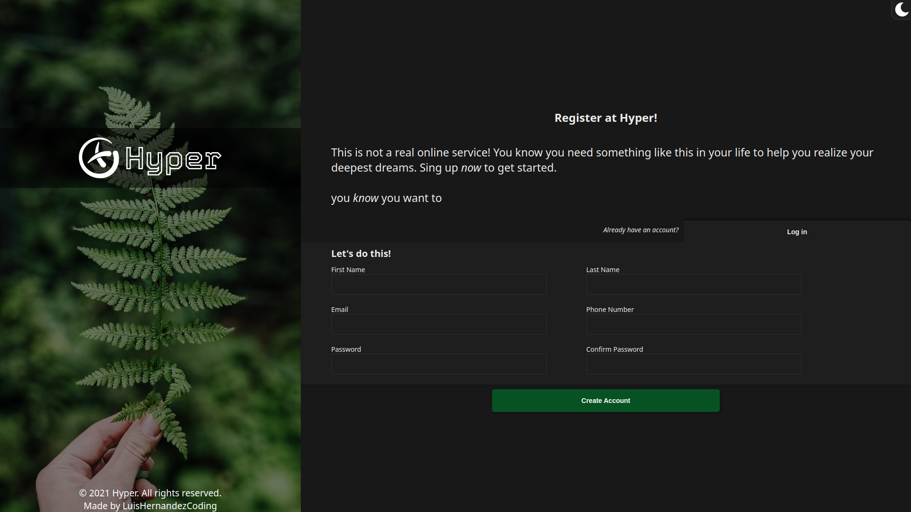

# Sign Up Form in Html, Css and Javascript

In this project I will create a sign up form in HTML, CSS and Javascript. The form will have the following fields: first name, last name, email, phone, password and password-confirm

###### - Extra: its made with responsive approach in mind (test it on small screens)
###### - Extra: it includes Dark mode

## Previews
> Home preview

> 
> Home dark preview

> 
> Login preview

> 
> Login dark preview

> 
> Sign Up preview

> 
> Sign Up dark preview

> 

## The project

#### Definition

The project is a sign up form in HTML, CSS and Javascript. The form will have the following fields: first name, last name, email, phone, password and password-confirm. It will have the following validations:

* First name: Required
* Last name: Required
* Email: Required and must be a valid email
* Phone: Required and must be a valid phone
* Password: Required and must have at least 8 characters
* Password-confirm: Required and must match with password

> The project is made with responsive approach in mind (test it on small screens)

## Learning outcome

##### Learning Goals / Areas of Focus

* Understand how to create a form with HTML
* Understand how to style a form with CSS
* Understand how to add validations to a form with Javascript

##### Challenges

* Make the form responsive
* Add dark mode

## Built With

- VS Code
- HTML
- CSS
- Javascript
- Git flow
- Github

## Getting Started

To check it out just go to this [Live Demo](https://luishernandezcoding.github.io/sign_up_form_html_css/)
